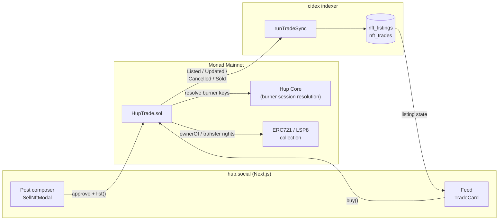

# HupTrade 🖼️ — sell NFTs inside your posts

**Non-custodial NFT sales embedded directly in a social feed.** List an NFT from the post composer, and your followers see a live buy button in their timeline — no marketplace tab, no custody, no leaving the conversation.

Built by [Hup Labs](https://hup.social) for the **Spark hackathon** (BuildAnything × Monad, Jul 13–19, 2026).

- **Live app:** https://hup.social (connect a wallet, switch to Monad)
- **Contract (Monad Mainnet, chainId 143):** [`0x80218c06A00316687957951036bbD1326a6790C1`](https://monadexplorer.com/address/0x80218c06A00316687957951036bbD1326a6790C1)
- **Main app monorepo (public):** https://github.com/web3senior/hupsocial

## The problem (a personal one)

I run [Hup](https://hup.social), a small onchain social network, and I own NFTs I'd occasionally like to sell. My actual audience — the people who know me and my work — is in my feed, not on any marketplace. Selling meant posting a screenshot, linking to an external marketplace, hoping people bridge the context gap, and losing the thread where the interest actually happened. Marketplaces have liquidity but not *my* people; my feed has my people but no way to transact.

## The solution

HupTrade makes the post itself the point of sale:

1. **List from the composer.** Pick an NFT you own (ERC721 or LSP8), set a price in the native coin or any ERC20/LSP7 token, and attach it to a post. The app asks the collection for approval/operator rights — **the token never leaves your wallet**.
2. **Followers see a TradeCard in the feed** — artwork, traits, price, and a buy button, rendered inside the post.
3. **One click to buy.** The contract re-verifies ownership and transfer rights at settlement time, splits the payment (seller / optional platform fee / optional referral share), and moves the NFT — all in a single transaction.
4. **Reposts can earn.** A listing may carry a referral share (up to 50%): if a sale lands through someone's repost, the contract pays that reposter their cut at settlement. Distribution becomes an incentive, which is exactly how a social feed should sell things.

No escrow, no custody, no order book. If you transfer the NFT away or revoke approval, the listing simply goes stale and the contract refuses to settle (`StaleListing`).

## Why Monad

Listing, updating, cancelling, and buying are all everyday social actions here, not rare marketplace ceremonies. That only feels natural when transactions confirm fast and cost effectively nothing — which is what Monad delivers. The same contract is multichain by design (it also runs on LUKSO mainnet supporting LSP7/LSP8), but Monad is where "commerce as a post" feels like posting.

## Architecture



- **Onchain** — [`contracts/Extensions/HupTrade.sol`](contracts/Extensions/HupTrade.sol) holds all state and settlement logic. Every state change emits one of four events; full listing state is derivable from `Listed` / `ListingUpdated` / `ListingCancelled` / `Sold` alone.
- **Offchain** — [`indexer/tradeSync.js`](indexer/tradeSync.js) (excerpt from our cidex indexer) replays those events into `nft_listings` / `nft_trades` and produces sold/purchased notifications. The app only reads the DB; the chain is the source of truth.
- **App** — [`app/`](app/) contains reference snapshots of the UI: the listing modal, the in-feed TradeCard, and the metadata hook that resolves ERC721 `tokenURI` and LSP8 LSP4 metadata (IPFS-aware, with a `TokenMetadataBaseURI` fallback).

## Contract design notes

- **Non-custodial by construction.** `list()` verifies the caller owns the token *and* has granted the contract transfer rights (`approve`/`setApprovalForAll` for ERC721, `authorizeOperator` for LSP8). `buy()` re-verifies both at settlement, so a stale listing can never move a token.
- **Dual-standard.** One contract handles ERC721 and LSP8 collections, and native / ERC20 / LSP7 payment tokens. Token ids are stored as `bytes32` for both standards. ERC721 settlement uses `transferFrom` (not `safeTransferFrom`) so smart-wallet buyers without `onERC721Received` — e.g. LUKSO Universal Profiles — can still receive.
- **Referral share** (`referralBps`, capped at 50%) is set per listing and paid at `buy()` to a referrer supplied by the client (never the buyer or seller themselves).
- **Session keys.** Hup uses short-lived burner keys so posting doesn't prompt your cold wallet; HupTrade resolves burners to primary wallets through Hup Core, so listings belong to the real owner.
- **Meta-transactions** via rotatable ERC2771 trusted forwarders; admin surface is OpenZeppelin `AccessControl` + `Pausable`, settlement is `ReentrancyGuard`ed, effects-before-interactions throughout.
- **One active listing per token.** A leftover listing whose seller no longer owns the token is auto-cancelled and replaced on relist (`ListingCancelled` with `invalidated=true`).

## Repository layout

```
contracts/
  IHup.sol                  Hup Core interface (burner session resolution)
  Extensions/
    HupTrade.sol            The protocol — storage, listing, settlement, admin
    IHupTrade.sol           Shared structs, events, errors, full NatSpec API
    ILSP7Minimal.sol        Minimal LSP7 payment interface
    ILSP8Minimal.sol        Minimal LSP8 collection interface
abi/HupTrade.json           Deployed ABI
app/                        Reference snapshots of the live UI (canonical source: hupsocial repo)
indexer/tradeSync.js        Reference excerpt of the cidex indexing loop
```

## Build

Sources compile with `solc ^0.8.35` and OpenZeppelin Contracts `^5.4.0`. With Foundry:

```sh
forge init --no-git . 2>/dev/null || true
forge install OpenZeppelin/openzeppelin-contracts
echo '@openzeppelin/contracts/=lib/openzeppelin-contracts/contracts/' > remappings.txt
forge build --contracts contracts
```

## Deployments

| Chain | Chain id | HupTrade | Hup Core |
| --- | --- | --- | --- |
| Monad Mainnet | 143 | [`0x80218c06A00316687957951036bbD1326a6790C1`](https://monadexplorer.com/address/0x80218c06A00316687957951036bbD1326a6790C1) | `0x8b76923EA3BFAA8EB29FC58e81E49F3c4Fa9Ba8A` |
| LUKSO Mainnet | 42 | `0x4bad88a02d8a4926fE50F69A12A3e095E433CEc0` | `0xf6eeC4e32a532b23ACC56b72865e79c79877CEc8` |

## Try it (3 minutes)

1. Open https://hup.social and connect a wallet on **Monad** (you'll need a little MON for gas).
2. Start a new post → choose the **Sell NFT** action in the composer toolbar.
3. Pick a collection + token you own, set a price (MON or a custom token), optionally a referral share, and approve + list.
4. Publish. The post now renders a TradeCard; from another account, hit **Buy** and watch the NFT and payment settle in one transaction — the seller gets an "NFT sold" notification.

## Provenance & hackathon honesty

HupTrade is a new feature of my existing open-source social app, Hup. **All HupTrade work was designed, written, deployed, and shipped inside the Spark window** — the feature commits in the public [hupsocial](https://github.com/web3senior/hupsocial) monorepo:

- [`d473353`](https://github.com/web3senior/hupsocial/commit/d473353) feat: sell NFTs inside posts via HupTrade (ERC721 + LSP8)
- [`95bfc7c`](https://github.com/web3senior/hupsocial/commit/95bfc7c) chore: register HupTrade LUKSO mainnet deployment
- [`b508620`](https://github.com/web3senior/hupsocial/commit/b508620) fix: resolve LSP8 metadata via TokenMetadataBaseURI fallback
- [`d3d58f6`](https://github.com/web3senior/hupsocial/commit/d3d58f6) feat: TradeCard asset links, traits, and redesigned layout
- [`a141f4f`](https://github.com/web3senior/hupsocial/commit/a141f4f) feat: custom payment tokens and honest token previews in SellNftModal
- [`d01ff8f`](https://github.com/web3senior/hupsocial/commit/d01ff8f) fix: recover NFT listings orphaned by abandoned posts

This repo extracts the protocol (contracts, ABI, indexer loop, UI snapshots) into a focused, reviewable package for judging. The pre-existing Hup platform (posts, profiles, feeds) is *not* part of this submission — HupTrade is.

## License

[MIT](LICENSE) © Hup Labs
